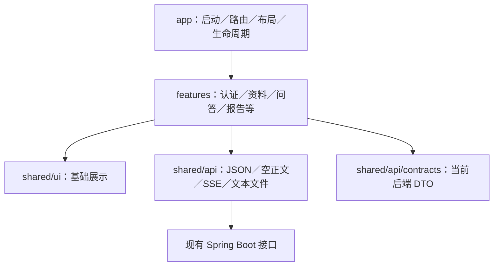

# AI 知识库助手前端：项目架构、技术选型与页面规划

> 历史规划：本文件保留 2026-10-03 的设计及来源引用。当前功能、操作和验收请从 [文档中心](docs/README.md) 进入；实施协议以 [当前联调说明](docs/接口联调/前端接口与联调说明.md) 为准。正文中的旧边界、路径和规划目录不作为当前项目状态。

> 修订日期：2026-10-03。本版根据实际联调契约重新审查，替换此前按完整后端愿景安排的当前开发范围。
>
> 当前实施依据：[frontend-development-guide.md](D:/AIStudy/frontend-development-guide.md)；产品长期目标参考[后端架构](D:/AIStudy/AI模型应用开发学习验证项目架构.md)。
>
> 已只读核对 D:/AICodeProject/Novid 的四个业务 Controller、Requests、关键返回 DTO 和实施状态。当前目录的联调文档与后端 docs 副本内容一致；本次没有运行后端测试、访问模型、修改后端或创建前端工程。
>
> 推荐方案仍是单个 Vue 3 + TypeScript + Vite SPA，按业务功能组织模块。前端不计入原七个 Maven 模块。当前只建设已有接口支持的页面；多轮会话、完整执行图、费用明细、视频等保留为后续目标。

## 0. 实施边界与依据优先级

**【必须】**

1. 当前前端以联调文档、实际 Controller／DTO、实际响应样例为准。原架构中的计划接口不能当作已实现接口；发现三者不一致先记录并核对，不用 Mock 掩盖。
2. 前端处理展示、输入、请求、状态投影。权限、检索、模型选型、任务执行、来源展开和确认消费留在后端，不编写客户端 Agent 或权限旁路。
3. USER 只读写自己的知识资料；ADMIN 可读取他人有效资料但仍仅修改本人的资料。任务、笔记确认、偏好、产物和运行摘要始终仅本人。
4. 内存保存不透明 Bearer token，刷新后重新登录；不擅自更换 JWT、Cookie 会话、持久化 token 或加入不存在的 refresh-token 流程。
5. 这是前端框架升级规划：替代原轻量 HTML 页面，后端仍使用现有接口。只维护一套正式前端入口。
6. API 返回裸对象／裸数组或空正文；JSON 未知字段会被后端拒绝。不能套通用后台模板的 code／data／total 包装，也不能把响应对象直接提交为 PATCH。
7. 当前不提供视频、全文搜索结果页、会话历史、完整任务列表、动态计划、费用图表、执行 DAG、审计查询和模型管理页。预留设计不等于向用户展示可用入口。

**【默认】**中文、桌面 Chrome／Edge 最近两个主要版本优先，窄屏完成问答、文档查看、笔记确认和报告操作。当前阶段不引入 SSR、微前端、WebSocket 或额外业务服务器。

### 0.1 当前可开发能力

| 能力 | 当前实现 | 前端安排 |
|---|---|---|
| 登录／账号／用户管理 | 已有正式接口 | 开发完整登录、改密及 ADMIN 用户页 |
| 知识库／TXT 与 Markdown／统计 | 已有 CRUD、目录／小片和三项统计 | 开发资料管理、结构查看、入库状态与恢复入口 |
| 问答 | 单轮，JSON／SSE | 展示当前页面消息，但明确每次问题独立，不承诺记住上文 |
| AI 笔记 | prepare、详情、决定已实现 | 开发完整准备→预览→批准→获取文档流程 |
| 个人偏好 | GET／POST／PATCH／DELETE 已实现 | 支持添加、查看、更正、删除 |
| FAQ／研究报告 | 创建、单任务查询、动作、Markdown 产物 | 开发“报告任务”，展示本页已知 ID 和单任务详情 |
| 运行 | 列表／详情均为摘要 | 只展示状态、modelId、尝试次数、createdAt、mock |
| 会话／视频／费用／执行图／审计 | 没有完整公开契约 | 后续再开发，不生成假页面和假数据 |

## 1. 技术选型与版本策略

| 方面 | 选择 | 当前实施要求 |
|---|---|---|
| 应用框架 | Vue 3、Composition API、script setup | 单文件组件，官方 create-vue 工程 |
| 类型 | TypeScript 稳定版，strict | 请求／响应和 UI 状态明确区分 |
| 构建 | Vite 8 稳定系列＋官方 Vue 插件 | 独立开发／构建，实际安装验证兼容组合 |
| 构建运行时 | Node.js 24 LTS，至少 24.12.0 | 满足当前 create-vue 要求；生产静态页面不依赖 Node |
| 包管理 | pnpm 受支持稳定版 | 一个 package.json／锁文件，固定 packageManager |
| 路由／共享状态 | Vue Router、Pinia 3 稳定系列 | 路由懒加载；Pinia 只存有限跨页面状态 |
| UI | Element Plus 2 稳定系列＋CSS | 表单、表格、抽屉、上传；分页不用伪造 total |
| HTTP／文本下载 | fetch＋统一 Transport | 裸 JSON、200 空正文、multipart、认证文本请求 |
| SSE | fetch ReadableStream＋eventsource-parser | POST＋Bearer；等正常 EOF，不在 done 时直接关流 |
| 契约类型 | 当前 DTO 类型声明；有实际 OpenAPI 后用 openapi-typescript | 不伪造 schema，不手改生成文件 |
| 运行时校验 | Zod，局部使用 | 校验关键响应／SSE，处理未知状态和不安全数字 ID |
| Markdown | markdown-it＋DOMPurify | 禁用原始 HTML／远程图片自动加载，引用单独处理 |
| 测试／规范 | Vitest、Vue Test Utils、Playwright、ESLint、Prettier | 验证协议、版本、权限交互和真实浏览器路径 |

技术选型不需重做，重点是减掉当前没有数据源的依赖和页面。Vue Flow、dagre、ECharts 暂不安装到当前运行依赖；有真实步骤、依赖边或指标契约后再引入。

Vue 官方支持 Vite＋TypeScript；Vite 构建不代替完整类型检查，必须另跑 vue-tsc。[Vue 工程](https://vuejs.org/guide/quick-start.html)、[TypeScript 检查](https://vuejs.org/guide/typescript/overview)

Vite 8 是稳定系列，Node 24 为 LTS；实际补丁、pnpm、TypeScript 和插件在创建工程时共同锁定，提交 pnpm-lock.yaml，不让 CI 每次浮动升级。[Vite 8](https://vite.dev/blog/announcing-vite8)、[Node 发布周期](https://github.com/nodejs/Release)、[pnpm](https://pnpm.io/installation)

## 2. 前端架构与依赖方向

### 2.1 模块分工

| 层次 | 职责 |
|---|---|
| app | 启动、路由、布局、Transport 装配、登录生命周期清理 |
| features | 功能页面、表单、状态流程、请求构造、DTO→ViewModel |
| shared | 通信、协议解析、契约类型、安全渲染、基础 UI |
| 现有后端 | /api/v1 REST／SSE、权限和任务执行 |



编译依赖只允许 app → features → shared；shared 不导入 features／app。前端不照搬后端 AI 六层或七个 Maven 模块，不拆多个 npm 子包。

### 2.2 消除循环和重复逻辑

- Transport 不导入 auth store。app 注入 getToken、getAuthEpoch 和认证失败策略，避免 auth.api → Transport → auth.store 循环。
- knowledge 公开 ScopePicker 和 SourceDrawer；chat／tasks 可以使用，knowledge 不导入它们的内部 store。
- approvals 公开快照展示和决定流程；不反向依赖 chat。notes/prepare 的请求由 chat 交互发起，确认的读取／决定集中在 approvals。
- runs 消费运行摘要接口；其他模块只按 traceId 跳转，不借运行记录恢复任务或聊天。
- 各功能提供清理入口，由 app/lifecycle 协调注销、账号切换和晚到响应处理。
- 模块通过 index.ts 的少量公共入口协作，不跨模块引用内部页面／store。
- ID 登记只是当前浏览器已知资源索引，不能替代服务端列表、历史或来源审计。

## 3. 工程目录与职责

```text
lab-frontend/
├─ package.json
├─ pnpm-lock.yaml
├─ vite.config.ts
├─ tsconfig*.json
├─ .env.example
├─ index.html
├─ docs/
│  ├─ backend-contract.md          # 联调契约版本／来源；不含环境凭证
│  ├─ integration-gaps.md          # 已知后续接口需求与实际差异
│  └─ version-validation.md        # 实际依赖版本／浏览器验收
├─ public/                         # 只放公开静态素材
├─ src/
│  ├─ app/
│  │  ├─ bootstrap.ts
│  │  ├─ router/
│  │  ├─ layouts/
│  │  ├─ capabilities.ts           # 当前版本功能白名单，不是假定的远端接口
│  │  └─ lifecycle/
│  ├─ features/
│  │  ├─ auth/                     # 登录、me、改密、退出
│  │  ├─ knowledge/                # 库／资料、范围、统计、结构、禁用库恢复
│  │  ├─ chat/                     # 单轮请求、页面消息、SSE、引用、笔记准备
│  │  ├─ approvals/                # 本人确认读取与 approved 决定
│  │  ├─ tasks/                    # 报告创建、已知任务、状态、动作、产物
│  │  ├─ memories/                 # 本人偏好 CRUD
│  │  ├─ runs/                     # 本人运行摘要
│  │  ├─ admin/                    # 账号创建、列表、启用／角色调整
│  │  └─ settings/                 # 本人账户与非敏感主题偏好
│  ├─ shared/
│  │  ├─ api/
│  │  │  ├─ transport.ts
│  │  │  ├─ errors.ts
│  │  │  ├─ contracts/backend.ts   # 当前 17 个返回 DTO 的契约；有 schema 后生成
│  │  │  └─ sse/
│  │  ├─ ui/                      # 加载、空页、错误、状态、无 total 分页
│  │  ├─ security/                # 安全 Markdown／链接
│  │  ├─ lib/                     # 日期、UTF-8 字节、码点与 ID 检查
│  │  └─ styles/
│  └─ main.ts
├─ tests/
│  ├─ integration/                # 通信／SSE／审批／版本／身份清理
│  └─ e2e/                        # 真实后端浏览器路径
└─ dist/                          # 构建产物
```

功能模块按需要设置 pages、components、api.ts、model、composables、store.ts、index.ts；没有状态就不建 store。共享目录只集中 HTTP 契约与基础能力，不成为业务实体仓库；ViewModel 和请求构造留在功能模块。

后续取得实际 OpenAPI 时保存版本化导出并生成类型，当前没有导出就按联调文档／DTO 建立精确声明。不能先生成一份假 OpenAPI，再把它称为实际后端契约。

## 4. 页面与路由：当前可交付版

主要导航：“知识问答、知识库、报告任务、个人偏好、运行摘要”；ADMIN 增加“用户管理”。账号设置放右上角。授权文档统计放知识库页面，不单独建立系统指标首页。

F1～F3 是前端实施顺序；F4 仅为后续目标，不代表后端已具备。

| 页面／路由 | 当前功能 | 阶段 |
|---|---|---|
| /login | 用户名／密码登录、凭证错误／限流 | F1 |
| /change-password | passwordChangeRequired 强制改密 | F1 |
| /settings | 修改密码、退出、主题 | F1 |
| /knowledge-bases | 启用且可读库、范围、三项文档统计、新建自有库 | F1 |
| /knowledge-bases/:id | 元数据、本人编辑／启停／删除、文档列表／上传；禁用库只显示合法元数据和恢复 | F1 |
| /documents/:id | 当前正文、目录／小片、状态、手工修订／删除／重处理 | F1，高级结构 F3 |
| /chat | 独立问题、当前页消息、引用、笔记准备 | F1 |
| /approvals/:approvalId | 本人完整确认快照、批准／拒绝、文档结果 | F1；也可抽屉显示 |
| /tasks | 创建 FAQ／研究报告、本页已知任务、按已知 ID 打开 | F2，不能标作完整任务列表 |
| /tasks/:id | 本人状态、completedSteps、动作、报告预览／下载 | F2 |
| /memories | 本人偏好添加／查看／更正／删除 | F2 |
| /runs、/runs/:traceId | 本人运行摘要，不展示不存在的图和费用 | F3 |
| /admin/users | 创建 USER、临时密码一次性、账号启停／角色 | F1 |

提供 403／404／功能未支持状态，未知资源可能返回 403。禁用库恢复可放知识库页的“通过已知 ID 恢复”入口，不额外设计完整禁用库列表。

不注册视频、模型管理、审计、执行图或全局全文搜索页面。无服务端任务／确认／产物列表，不能用 runs 拼出这些列表。

### 4.1 ID 登记与刷新恢复

任务创建／确认准备／审批成功后，可在内存按当前 user.id 登记 taskId／approvalId／artifactId，限制最多 100 项，帮助当前页面再次查询。只保存必要 ID／关联，不把猜测状态当事实；注销／账号切换清理。

默认不把这些私有索引或正文持久化到浏览器磁盘。刷新会丢失登记列表；用户可复制站内资源深链接或手工输入已知 ID，重新登录后通过 GET 复核。此方式不能恢复其他浏览器的任务，页面必须说明是“本页已知记录”。

禁用库操作前展示并允许复制库 ID／站内链接；禁用后该库从列表消失，但 owner 可以按已知 ID 读取元数据和启用。不能承诺通过全量禁用库列表恢复，不能假装列表中仍有禁用项。

### 4.2 基本体验

loading／empty／error／restricted 一致；内容安全转义，状态文字配合颜色。列表与正文清楚区分“当前页”和“整个授权范围”，不显示伪造页数／百分比。

主题与显示偏好可 localStorage，token／密码／聊天／审批正文／报告不持久化。窄屏收起导航，来源与确认抽屉可全屏；关键内容完整可读，按钮有标签和焦点管理。

## 5. 关键流程

### 5.1 登录、改密码与 401 的区别

登录响应为 LoginResult：token、expiresAt、user。当前身份字段是 user.id、user.role、user.passwordChangeRequired；不要读取旧设计中的 mustChangePassword 或假定 login 返回 userId。

passwordChangeRequired=true 只允许 me、password、logout。修改成功是 200 空正文，同时撤销当前和其他旧 token；立即清理身份并重新登录。token 当前八小时，无 refresh／续期接口；刷新重新登录后只回跳站内白名单路径。

**认证失败按调用场景处理：**

- 登录 401：凭证错误，停留登录页，不循环重登录。
- 普通受保护请求 401：当前身份代次失效，清理状态并引导登录。
- 修改密码 401：可能只是 oldPassword 错误。保留输入流程，调用 me 复核；me 成功则提示原密码错误，me 401 才退出。网络失败显示暂无法核实，不直接认定登录过期。
- PASSWORD_CHANGE_REQUIRED 为 403：进入改密，不作为普通资源越权处理。

用户名 3～64 个 A-Z、a-z、0-9、下划线、点或短横线。新密码 12～64 个 UTF-16 单元且最多 72 UTF-8 字节；登录密码也最多 72 UTF-8 字节。用 string.length 和 TextEncoder 字节检查，中文字符不能只看长度。联调文档正文码点限额是另一种计数，不能混用。

ADMIN 创建只发送 username，返回 temporaryPassword 只展示一次；没有用户删除或重置密码接口。启停／角色 PATCH 必须显式发送 enabled 和 role，最后有效管理员由后端保护。

### 5.2 读取范围、库管理与统计

JSON 问答／任务使用 scope；知识库／文档 GET 使用 scopeMode、knowledgeBaseIds、ownerUserId 查询参数：

```json
{"mode":"SELECTED","knowledgeBaseIds":[12,18],"ownerUserId":null}
```

SELF／ALL 的 knowledgeBaseIds 为空；SELECTED 最多 100 个正数库 ID，空集合在后端表示零范围。为避免误操作，问答／报告表单 SELECTED 为空时要求选择，不擅自改成 ALL。越权／禁用 ID 混入时整体报错，不本地过滤后再发送。

读范围和写目标分开。上传和 notes/prepare 目标仅本人启用库；库创建不发送 ownerUserId。个人偏好／任务详情／确认／运行摘要不接受 scope。

库 PATCH 只发送 version、name、description、enabled；description 是字符串，可为空，boolean 显式发送。DELETE 在 query 提交 version。禁用库正文／文档列表不可读，owner 元数据和启用操作按已知 ID 进行。

统计只使用 documentCount、receivedCount、readyCount。GET /knowledge/statistics 不支持 ownerUserId：存在 owner 筛选时不展示看似同范围的统计卡片，或明确单独标为未按 owner 筛选；默认选择隐藏，不能把全部统计贴到某个人名下。统计不是文档分页 total，也不派生不存在的 failedCount、费用或延迟指标。

### 5.3 上传、修订、重处理

上传一个 UTF-8 TXT／MD／Markdown，可有 BOM；1～10485760 字节，文件名最多 200 个 UTF-16 单元且没有路径分隔符。multipart 只提交 file、knowledgeBaseId，并带合规 Idempotency-Key；不手工设置 Content-Type。

允许 MIME：text/plain、text/markdown、text/x-markdown、application/octet-stream。浏览器空或不受支持 MIME 可用同字节 Blob 包装为允许的文本 MIME并保留文件名，仍由后端校验扩展名和编码；不能借此上传其他格式。

202 返回 DocumentSnapshot，没有 ingestionId。当前公开状态只有 RECEIVED／READY／FAILED：展示“已登记待处理、已就绪、处理失败”，不画解析→向量化等精确实时阶段、块计数、失败原因或上传百分比。

通过 GET /documents/{id} 读取 DocumentContent，其中 document 是快照，text 是当前原文，sourceDependencies 是来源。READY 且 activeProcessingRevision 非 null 才加载结构／允许检索；没有激活结构的 sections／chunks 为 409 INDEX_NOT_READY。不要要求先看到 PROCESSING。

PATCH 只发送 documentVersion、title、text；DELETE 在 query 传 documentVersion。标题最多 200；正文非空白、最多 100 万 Unicode 码点和 10 MB UTF-8 字节。文档配额／库配额错误看 message，不能都提示“文件太大”。

index-actions 使用 query action=retry 或 reprocess、无正文，200 空响应。两者都会登记新处理代次，不能自动重发。重处理 READY 文档前记录 activeProcessingRevision；旧 READY 可保留，只有看到代次增大才说明新索引激活。没有批次详情／错误码时显示“已请求重处理，等待新代次”，不能据旧 READY 报成功，也不推断新批次失败。

修订后 documentVersion 增加，旧正文／结构缓存失效。前端重新读取 document 与目录／片时核对版本／激活代次；当前结构 DTO 没有自带这两个字段，跨请求过程中若版本变化，丢弃混合快照并重新加载，不能把旧 offset 用到新正文。

### 5.4 文档、章节和引用

GET documents/{id} 只读当前正文；source 是 text/plain UTF-8 附件，上传 BOM 已移除，不保证下载字节等于上传文件。不存在 section 单详情接口或历史版本读取参数。

目录按分页 SectionSnapshot 的 sectionId／parentSectionId／ancestorSectionIds 建树；父节点未加载时标示目录未完整，不能当作根或合并同名标题。当前返回 headingPath、ordinal、startOffset、endOffset；不能假定存在完整 sourceMap／页码／标题解析对象。

ChunkSnapshot 有 rawText、embeddingText、contextParentId 和序号／范围；父段 ID 仅用于结构展示，当前没有单独父段 HTTP 查询接口，不用猜测 ID 拼 URL。

EvidenceBundle 的 offset 为 UTF-16 左闭右开。只有 evidence.document.documentVersion 与当前 document.documentVersion 相同时，才在未经改写的 DocumentContent.text 上执行 slice(startOffset,endOffset) 定位。不能在 Markdown HTML、重排版／改换行文本中套 offset。

版本不同时展示 evidence.text 与旧版本标签，说明当前原文已更新；不请求不存在的历史参数，不在新正文误高亮。同一内容版本重处理导致不同 processingRevision 时，原文 offset 仍按实际原文验证，但不能拿当前 chunks／sections 假装证明旧批次的 ID；显示证据原始处理代次即可。

[E1] 等对应 evidenceId；citations 是模型收到的证据集合，不保证全部被回答引用。展示实际文本、matchedChunkIds 与 includedChunkIds 的区别，不将 seed 命中误作整个上下文，也不声称 UI 已验证每个结论支持性。

打开新的引用重新通过当前文档接口复核；403 就清理该来源缓存并提示不可访问，不继续用旧缓存绕过来源撤销。界面已经合法显示的内容无法撤回，不承诺持续页面可以逆转既往阅读。

### 5.5 单轮问答与笔记准备

问答请求只有 question、scope；禁止发送 sessionId、history、modelId、预算或角色。question 去空白后非空，最多 2000 个 UTF-16 单元。当前页面可展示多条往来，明确“每次问题独立；请在当前问题中写明必要背景”，不显示已记忆上轮或会话列表。

以“统计”开头的去空白问题走程序统计；modelAttempts 可为 0、modelId=program、无 citations，并不表示请求出错。NEEDS_INPUT 是合法 200 的无可用证据响应，不等同 HTTP 失败，也不能断言全部知识资料中不存在答案。

AiResult 当前仅 SUCCESS／NEEDS_INPUT，字段为 answer、citations、traceId、modelId、modelAttempts、mock、error。没有 Token、价格、profile、供应商名称或路由原因；modelId=primary／program／none 是内部标识，不应显示成一个未经证明的供应商名称。

保存笔记流程：

1. 从完整 citations 的 document 元信息构造 SourceDependency，按 documentId＋documentVersion 去重；保守保留证据来源，不用前端随意删除约束。无来源的程序统计不开放此 AI 笔记接口。
2. 用户选择本人启用目标库，核对 title／content，发送 notes/prepare 的四个字段：knowledgeBaseId、title、content、sourceDependencies。来源 1～32 项，ID／版本正数。
3. prepare 返回 ApprovalSnapshot，不代表笔记已保存；由 approvals 展示完整返回来源，服务端可能展开派生依赖。
4. 阅读后只提交 approved=true 或 false。操作前 GET /approvals/{id} 复核快照、来源、目标和期限。
5. 只有 status=APPROVED 且 documentId 非 null 才显示保存成功并提供文档入口。新笔记仍需入库，不立即显示可检索。

prepare 无幂等键保障，网络结果不明不能自动创建第二份确认。修改正文／目标后重新 prepare，不能在旧确认上回传改写参数。批准成功的同一确认可返回既有文档，不因此重跑 prepare。

### 5.6 笔记确认状态

ApprovalSnapshot 状态仅 WAITING／APPROVED／REJECTED，不读取 operationType 或视频预览字段。有效期 30 分钟；过期可能仍为 WAITING，页面依据 expiresAt 显示到期，不捏造后端 EXPIRED 状态，最终以后端 410 为准。

targetVersion 是目标知识库版本，不是 documentVersion。版本／来源变化时，409 APPROVAL_CONFLICT 或其他拒绝后重新读取／准备。拒绝已批准、重复处理已拒绝可冲突；不要把拒绝当作撤销已写入文档。

decision 响应仍是 ApprovalSnapshot，文档创建结果由 documentId 给出，不等待不存在的 operation 查询。确认／产物没有列表接口，已知 ID 可重查，其余记录无法从浏览器完整恢复。

### 5.7 FAQ／研究报告与报告预览

创建任务只发送 taskType、topic、scope、documentIds，taskType 为 FAQ／RESEARCH_REPORT；topic 非空、最多 1000 个 UTF-16 单元，documentIds 为 1～6 个正数且属于授权范围。任务读取原文，不要求文档已经完成向量索引；不能用 RAG READY 条件禁止合法报告任务。

创建须带 Idempotency-Key，202 返回 TaskSnapshot。当前 completedSteps 是固定三步的已完成数量，只显示“完成 n／3 步”，不编造当前角色、实际并行、具体步骤日志或百分比。

| 当前状态 | 可用动作／产物 | 轮询 |
|---|---|---|
| QUEUED／RUNNING | pause、cancel | 继续 |
| PAUSED | resume、cancel | 停止或低频 |
| SUCCEEDED／PARTIAL | artifactId 非 null 时认证下载／预览 | 停止 |
| FAILED／CANCELLED | 无原任务状态操作；失败可由用户明确另建任务 | 停止 |

actions 仅 JSON action，不提交 stateVersion。重复 pause／resume／cancel 可能 409，断线后先 GET 状态，不自动重发。未知状态禁用修改按钮。PARTIAL 是有产物的终态，覆盖说明读报告正文，不等待或 resume。

任务详情字段只有 taskId、requesterUserId、taskType、status、stateVersion、modelAttempts、completedSteps、errorCode、artifactId；没有 topic／创建时间／覆盖数据／节点详情。创建时输入可作为明确标注的本页表单信息保留；直接打开历史 ID 时不伪造这些字段。

下载使用 artifactId。GET /artifacts/{id} 直接返回 text/markdown 附件，无 JSON 元信息接口；先认证 fetch 读取文本后可安全 Markdown 预览，再下载。报告中的 [D101v1] 是版本引用，没有来源清单查询契约，不自动用当前文档正文解释为历史原文。

取消／暂停只改变后端执行权，模型可能仍计费；关闭浏览器或 Abort 不等于 cancel。来源撤销后已成功任务的产物仍可能 403，显示当前不可访问并清理缓存，不能复用旧文件绕过验证。

### 5.8 偏好、运行摘要与用户管理

memories 已有新增接口，无分页参数。POST 仅 content；PATCH 为 version、content；DELETE query version。内容最多 2000 个 UTF-16 单元、每人最多 100 条；不将模型推测自动保存为偏好。

记忆版本不匹配当前为 403，不统一映射成 409，也不退出登录。先重新查询本人 memories 列表核对版本／存在性，若仍可读让用户核对后再提交；读取也被拒绝则清理相关内容，不自动覆盖或重试。

runs 分页返回 TraceSnapshot[]，详情也是摘要。只显示 traceId、status、modelId、attempts、mock、createdAt。无输入／答案／步骤／时延／Token／价格，不能用尝试次数推算成本或用 createdAt 假造耗时。失败响应不保证 traceId，不从列表猜关联。

ADMIN 当前只有用户管理，暂无 /admin/metrics、/admin/access-audit。无他人运行／任务下钻，也不做模型密钥管理。偏好、任务、审批、产物和运行页面不带知识 Scope。

## 6. 当前已实现接口对照

所有业务路径相对 /api/v1；只有 login 无需 Bearer。健康检查另为 GET /actuator/health，无认证，不证明模型／ES／Worker 可用。

下面 37 个方法／路径与当前四个 Controller 对照；JSON 成功无包装，“空”表示 200 空正文。

| 方法 | 路径 | 发送内容 | 返回 |
|---|---|---|---|
| POST | /auth/login | username、password | LoginResult |
| POST | /auth/logout | 无正文，带 Bearer | 空 |
| GET | /auth/me | 无 | UserSnapshot |
| POST | /auth/password | oldPassword、newPassword | 空；旧 token 全部撤销 |
| POST | /admin/users | username | CreatedUser |
| GET | /admin/users | page、size | UserSnapshot[] |
| PATCH | /admin/users/{id} | enabled、role | UserSnapshot |
| POST | /knowledge-bases | name、description | KnowledgeBaseSnapshot |
| GET | /knowledge-bases | scopeMode、knowledgeBaseIds、ownerUserId、page、size | KnowledgeBaseSnapshot[] |
| GET | /knowledge-bases/{id} | 无 | KnowledgeBaseSnapshot |
| PATCH | /knowledge-bases/{id} | version、name、description、enabled | KnowledgeBaseSnapshot |
| DELETE | /knowledge-bases/{id} | query version | 空 |
| POST | /documents | multipart file、knowledgeBaseId；幂等头 | 202 DocumentSnapshot |
| GET | /documents | scopeMode、knowledgeBaseIds、ownerUserId、page、size | DocumentSnapshot[] |
| GET | /documents/{id} | 无 | DocumentContent |
| GET | /documents/{id}/source | 无 | UTF-8 text/plain 附件 |
| GET | /documents/{id}/sections | page、size | SectionSnapshot[] |
| GET | /documents/{id}/chunks | page、size | ChunkSnapshot[] |
| PATCH | /documents/{id} | documentVersion、title、text | DocumentSnapshot |
| DELETE | /documents/{id} | query documentVersion | 空 |
| POST | /documents/{id}/index-actions | query action=retry／reprocess；无正文 | 空 |
| GET | /knowledge/statistics | scopeMode、knowledgeBaseIds；不接受 ownerUserId | KnowledgeStatistics |
| POST | /chat | question、scope | AiResult |
| POST | /chat/stream | 同 chat；Accept: text/event-stream | SSE 或非 2xx 错误 |
| POST | /notes/prepare | knowledgeBaseId、title、content、sourceDependencies | ApprovalSnapshot |
| GET | /approvals/{id} | 无 | ApprovalSnapshot |
| POST | /approvals/{id}/decision | approved 显式 boolean | ApprovalSnapshot |
| GET | /memories | 无，无分页 | MemorySnapshot[] |
| POST | /memories | content | MemorySnapshot |
| PATCH | /memories/{id} | version、content | MemorySnapshot |
| DELETE | /memories/{id} | query version | 空 |
| GET | /runs | page、size | TraceSnapshot[] |
| GET | /runs/{id} | 无 | TraceSnapshot |
| POST | /tasks | taskType、topic、scope、documentIds；幂等头 | 202 TaskSnapshot |
| GET | /tasks/{id} | 无 | TaskSnapshot |
| POST | /tasks/{id}/actions | action=pause／resume／cancel | TaskSnapshot |
| GET | /artifacts/{id} | 无 | UTF-8 text/markdown 附件 |

请求构造使用白名单字段，不展开响应对象；保持 query 与 body 分离。没有 GET /tasks、GET /tools、/documents/{id}/ingestion、/sections/{sectionId}、/runs/{id}/graph、视频 preview／media-operations 等公开接口。

### 6.1 分页与数组

page 从 0 开始、最多 10000；size 1～100、默认 20。分页返回裸数组，没有 total／hasNext／totalPages。memories 不分页。

文档列表分页后还会过滤不可读衍生来源，中间页也可能为空或不足 size。默认“上一页／下一页＋当前页”控件，上一页 page=0 禁用，下一页按 page 上限限制；空页允许继续下一页，不当作全库没有资料或最后一页。可回到第一页，不无限自动扫描空页。

其他数组接口也不伪造 total；section／chunk 若按当前实现到尾可停止加载，仍需明确目录／数据已加载范围，不能把有限分页当完整文档覆盖。分页 UI 的显示页号可以是 page+1，但请求必须 0 基。

### 6.2 ID、契约和长度

当前数值 ID 以 JSON number 返回，前端接收后检查正数与 Number.isSafeInteger；显示／键可转字符串，但发送 API 时遵循当前 number 契约。遇到超安全范围拒绝继续关键操作并协调后端改字符串，不先丢精度再补救，也不在本轮强制迁移全部 ID。

traceId、approvalId、sectionId、chunkId 是不透明字符串。任务、文档、KB、memory、artifact ID 不混用；尤其 artifactId 不是 taskId。

documentVersion、activeProcessingRevision、KB version、memory version、task stateVersion 分开。TaskStatus／AiResultStatus／ApprovalStatus／DocumentIngestionStatus 用当前各自枚举；未来未知值不能自动当 SUCCESS。

严格区分 UTF-16 长度、UTF-8 字节、Unicode 码点。普通字段按 JS length 对齐 Java String；正文码点可用码点遍历计数，不能用 text.length 代替；offset 仍是 UTF-16。运行时校验用于防止字段／类型误用，不赋予客户端额外授权。[类型生成的边界](https://openapi-ts.dev/introduction)、[Zod](https://zod.dev/)

## 7. 状态与 Transport

| 状态 | 存放 | 清理 |
|---|---|---|
| token、expiresAt、me、authEpoch | auth／app，内存 | 注销、有效身份失效、账号切换 |
| 读取 Scope／当前库 | knowledge 的有限 store | 身份切换／授权撤销；每次请求冻结快照 |
| 单轮流／当前页消息／引用 | chat | 页面退出中止流；身份或范围改变清理敏感上下文 |
| 确认快照、任务事实、报告文本 | 对应功能局部状态 | 重新 GET 复核；来源失败清理 |
| 已知 task／approval／artifact／禁用库 ID | 对应功能内存索引 | 注销／账号切换，最多 100 项 |
| 列表／表单／目录页 | 功能 composables | 页面或有界缓存 |
| 主题／显示偏好 | settings，可磁盘 | 不混入秘密或私有业务数据 |

首版保持 composables＋有限 Pinia，不再加入第二套全局查询缓存。前端不推进后台任务／入库状态；只是服务端当前事实投影。

Transport 提供 JSON／空响应／SSE／认证文本读取及取消，集中处理错误解码、authEpoch 和有限大小。请求显式声明响应模式：200 空正文返回 undefined，不调用 response.json；裸对象／数组不找 data；text/plain／markdown 不 JSON.parse。非 2xx 若为 JSON 读取 ApiError，代理 HTML 错误安全降级为 HTTP 错误。

Transport 不把所有 401 自动统一退出：采用 §5.1 的请求场景策略；改密原密码错误先 me 复核。403 资源失败与记忆版本失败按功能语义处理，不在底层一律退出身份。

每个请求冻结 actor／authEpoch；身份切换 abort 所有旧请求并丢弃晚到响应，包括旧请求返回 200 或 401。只有同身份代次的认证失败才触发该登录清理，防止旧响应退出新账号。

### 7.1 幂等与未知结果

上传／任务创建必须 Idempotency-Key，格式为 [A-Za-z0-9_.:-] 的 1～128 字符；一次新操作生成 crypto.randomUUID。网络结果未知且请求完全相同才复用同 key 重试，改文件／目标／主题／范围／文档集合换 key。当前至少保留七天，不承诺永久去重。

KB 创建、偏好创建、notes/prepare 无此去重保障；重处理每次创建新代次，task actions 重复可冲突。写请求不通用自动重试。审批网络未知优先 GET 当前确认，再按同一个 approvalId 处理，不重新 prepare 代替重试批准。

retryable 仅表示后端错误类别，不授权自动重发模型／报告／确认。GET 的有限退避可集中处理；未来未知 code 安全显示 message／code，不能用重试制造付费循环。

### 7.2 错误按功能处理

| 场景 | 处理 |
|---|---|
| 400 INVALID_ARGUMENTS／未知字段 | 检查白名单、枚举、ID／长度，保留合法输入 |
| 400／413 DOCUMENT_LIMIT_EXCEEDED | 看 message 区分大小／正文／配额，不一律说文件太大 |
| 403 ACCESS_DENIED | 读取失败清理相关来源／产物；记忆更新的版本场景单独复核 |
| 409 OPERATION_CONFLICT | 同键异参／版本／状态／用户名／最后管理员等，按当前操作重查 |
| 409 APPROVAL_CONFLICT、410 APPROVAL_EXPIRED | 读取或重新 prepare，不能回传改写参数 |
| 409 INDEX_NOT_READY | 等待当前版本索引，不访问不存在的 ingestion API |
| 409 STALE_EXECUTION | 刷新状态，不自动重放动作 |
| 429 RATE_LIMITED | 有 Retry-After 时采用；没有则有限退避，不循环登录 |
| 503／504 模型／搜索故障 | 提示本次不可用／未得到结果，用户决定是否重新问 |
| SSE error | 明确失败；不保证 retryable 或 traceId |
| INTERNAL_ERROR／未知错误 | 安全说明，不暴露堆栈、Authorization 或私人正文 |

MODEL_INVALID_OUTPUT／CONTEXT_MAPPING_INVALID／BUDGET_EXCEEDED 不是单纯表单错误；MODEL_ROUTE_NOT_FOUND／MODEL_CAPABILITY_MISMATCH 是后端配置／能力问题。不能以假答案或改浏览器 modelId 降级绕过。

## 8. SSE：当前协议的正确结束条件

POST /chat/stream 携带 Bearer、JSON 和 Accept: text/event-stream；无 GET 订阅、心跳、Last-Event-ID 回放或自动重连契约。

当前先完成问答和汇聚，再发送事件。收到第一个事件前可显示本地“正在处理”，但不能捏造“检索中／某 Agent 已运行”。delta 是已校验全文分段，每段最多 512 个 UTF-16 单元，不是模型 Token 流。

| 当前事件 | payload | 前端行为 |
|---|---|---|
| progress | stage=validated | 显示已校验，不解释成分阶段动态进度 |
| delta | text | 原样追加并节流渲染，保留拼接顺序 |
| citation | EvidenceBundle | 按 evidenceId 收集 |
| done | 完整 AiResult | 用 answer／citations 替换累积结果，进入等待 EOF 状态 |
| error | code、message；不保证 retryable | 失败并清理连接；不期待另有 done |

当前没有 approval_required。笔记确认由独立 notes/prepare 产生，不等待问答流发送确认事件。

**【必须】收到 done 不立即取消 reader，也不将全文再次追加。** 保留最终结果待确认传输结束，继续读到正常 EOF；正常 EOF＋合法 done 且无协议错误才能标记完整交付。done 后 reader 异常、半个未结束事件或无终态 EOF，显示“传输未完整结束／结果需核对”，不能悄悄标成功或自动重发。已明确收到 error 则失败，可取消读取并释放资源。

event id 是本次响应内从 1 开始的字符串，不是全局序号或恢复游标。仅同一流内去重；第二终态或非法顺序记录协议异常，不执行两次业务动作。未知事件不执行任意 UI 指令。

使用 TextDecoder 流式解码＋eventsource-parser，处理 UTF-8 分块、CRLF、多行 data、注释和半事件；设置解析与总消息上限，正常 EOF 检查未完成残留。协议解析留 shared，done／EOF reducer 留 chat；不能把网络 read() 的块当一个 JSON 事件。[SSE 解析器](https://github.com/rexxars/eventsource-parser)

非 2xx JSON 在开流前处理；HTTP 200 SSE error 仍失败。前端整个请求等待上限建议 90 秒，覆盖后端在线预算 60 秒／模型单次最多 30 秒；不能因无心跳在几秒内主动判故障。客户端时间是等待策略，不是服务端精确耗时／取消证明。

默认不自动重连或重新 POST。离开页面、退出、切范围可 Abort；只代表停止阅读／取消意图，已发模型可能继续。done 提供的 traceId 可跳运行摘要；未提供时不猜测。

## 9. 轮询、文件与安全显示

### 9.1 轮询和后台开关

文档查询 GET /documents/{id}，任务查询 GET /tasks/{id}；初始每 2～3 秒，上次完成后 setTimeout，避免重叠。稳定等待可退避至 5 秒，网络错误至 30 秒；可见页面才观察，隐藏时暂停，恢复时查询一次。

任务终态停止、PAUSED 停止或低频；文档 READY／FAILED 可停止，但本页已经请求 reprocess 的情况下继续观察代次，不按旧 READY 过早结束。单次自动观察窗口最多 30 分钟，到时手动继续；超时不自动改后台状态或取消任务。

联调文档记录的最近环境中 INGESTION_WORKER_ENABLED／TASK_WORKER_ENABLED 为 false。这是复测时事实，不代表永远关闭；联调前由后端负责人确认实际账号、索引、SEARCH_ENABLED 和 Worker 并按需要重启。前端没有启用 Worker、初始化索引、读取 Worker 状态或手工执行批次的接口。

RECEIVED／QUEUED 长时间不变只显示“等待后台处理，请核对联调环境”，不能断言前端故障或 Worker 必然关闭。健康接口成功也不能推断这些开关可用。

### 9.2 原文与报告的认证预览／下载

当前只有 UTF-8 文本原文和 Markdown 报告，没有视频。通过带 Authorization 的 fetch 读取；报告直接 text，原文下载直接附件，不能先请求 artifact JSON metadata。

若需要下载，读取有限文件形成 Blob URL；检查 HTTP 状态、MIME、声明大小与实际字节，规划默认单次最多 10 MiB 文本，实际部署可调为有界值。此为前端读取保护，不宣称后端报告限额等于它。正文渲染另按章节／片段控制 DOM 数量，不改变原文坐标。

source 附件名 document-{id}.txt，report 附件名 report-{taskId}.md；请求报告仍用 artifactId。来源授权失败清理对应预览／Blob；替换、关闭、注销及时 revokeObjectURL。公开 a／iframe 不会自动带该 Bearer，不把 token 放 URL。

没有历史原文下载、视频 Range、签名链接或公开视频地址。报告引用版本只展示原始标识，不据当前 source 下载冒充历史。

### 9.3 Markdown、缓存与授权

回答、笔记、原文、报告、标题、文件名与错误均视为不可信内容。Markdown 原始 HTML 关闭，再经 DOMPurify HTML 白名单净化；不执行动态模板、eval 或未经净化的 v-html。远程图片默认屏蔽，外部链接限制 http／https、明确外链并使用 noopener／noreferrer。[Markdown](https://github.com/markdown-it/markdown-it)、[净化规则](https://github.com/cure53/DOMPurify)

引用采用 EvidenceBundle，不能把 Markdown 任意 URL 交给带 token 的 Transport。统计回答没来源时不能假造 SourceDependency。

缓存按当前用户、完整 Scope、文档内容版本／激活代次隔离；授权失败和范围变化清理相关敏感内容。不持久化 token、私有正文、审批、报告，不以 Service Worker 离线缓存私有接口。新打开资源和确认／下载仍要向后端复核，TTL 不赋予持续访问权。

路由／按钮只优化体验，后端每次授权为最终依据；403 不猜资源是否存在，不自动将 SELF 扩大 ALL 或剔除越权 ID 后继续。

## 10. 开发、构建与发布

开发 API base=/api/v1，后端默认 localhost:8080。Vite 代理 /api；需要健康检查时单独代理 /actuator/health，不给所有 actuator 管理端点开放代理。当前无 CORS，不要求后端开放任意跨域。

VITE_* 只放公开 base／UI 白名单；模型、数据库、TTS、Langfuse、bootstrap 凭证不进入前端。app/capabilities.ts 的当前功能清单控制入口，不是安全授权或远端自动探测。[Vite 环境变量](https://vite.dev/guide/env-and-mode.html)

未来工程约定命令如下，本次没有运行：

```text
pnpm install --frozen-lockfile
pnpm type-check            # vue-tsc
pnpm lint
pnpm test                  # 协议／状态／功能测试
pnpm build
pnpm test:e2e              # 实际后端＋受控测试账号／数据
```

dist 同源交给当前静态发布流程或已有反向代理；不新增业务服务器。页面路由 SPA fallback，API／缺失资源不能返回 index.html。SSE 关闭代理缓冲，设置覆盖先计算后发送的等待时间；不缓存私有 API 或将用户内容放 public／dist。

构建固定锁文件；框架版本集需要安装、类型、构建和浏览器验证。静态资源采用 hash 缓存、入口谨慎缓存，验证合适 CSP／安全响应头。原前端若已存在，确认替换入口，不双轨维护。

## 11. 交付和验收

### 11.1 当前阶段

| 阶段 | 交付 | 退出条件 |
|---|---|---|
| F0 契约与环境 | 对照联调文档／DTO、37 路由，明确账号／Worker／索引 | 空正文、0 基分页、严格字段、权限和环境样例可复现 |
| F1 知识闭环 | 认证、USER／ADMIN、库／上传／状态、单轮问答／引用、笔记确认 | 实际可上传、问答并确认保存；不宣称多轮 |
| F2 私人报告／偏好 | 已知任务及详情、FAQ／研究报告、动作、Markdown 预览／下载、偏好 CRUD | 三步／状态／PARTIAL／来源拒绝正确，列表局限明确 |
| F3 检查与质量 | 目录／小片高级查看、运行摘要、通信／权限／版本回归 | 当前字段正确，无假 DAG、费用、统计或阶段进度 |
| F4 后续 | §12 所列能力 | 后端先提供契约和真实能力，再开放界面 |

### 11.2 必须验证的场景

| 场景 | 预期 |
|---|---|
| 登录 401、改密 401、普通 401 | 三种语义区分；错 oldPassword 不直接退出，有效改密清理旧 token |
| 首次改密／角色调整／最后管理员 | passwordChangeRequired 和 enabled／role 明确，最终以后端防护为准 |
| USER 越权／ADMIN 跨库只读 | 资料可读与写目标分开，个人资源始终本人 |
| 晚到响应／旧 401／账号切换 | authEpoch 隔离，清理流／轮询／私有缓存 |
| 裸数组、0 基、200 空正文、文档空中间页 | 不 unwrap data、不 JSON.parse 空串、不伪造 total／提前停翻页 |
| UNKNOWN JSON 字段、显式 boolean、query/body 区分 | 正确构造 PATCH、DELETE、index-actions、decision 和 task actions |
| 数字 ID、UTF-16／字节／码点 | 安全整数、字段长度与原文范围检查正确 |
| 上传 202／READY 重处理／旧代次 | 没有 ingestionId／假阶段，激活代次增大才确认 reprocess |
| 旧证据／当前新版／分页目录 | 旧 evidence.text 单独展示，不高亮新版，不伪造完整目录 |
| 单轮统计／NEEDS_INPUT／mock | 不记忆上轮，无来源不准备笔记，零 attempt 不算失败 |
| SSE 分块／done 覆盖／正常 EOF／done 后异常 | 不重复全文；异常不报完整交付；无自动 POST 重连 |
| prepare／expired WAITING／approved documentId | 准备不是保存，过期不猜 EXPIRED，完整来源／版本复核 |
| memory 版本 403 | 重新查询本人列表，不误登出、误改 409 或自动覆盖 |
| 任务七状态／PARTIAL／重复动作／未知结果 | 原任务终态不 resume，按 artifactId 下载，确认状态后再发动作 |
| Worker 未开／健康成功／长等待 | 不伪造失败或自动处理，只提示核对环境 |
| 来源撤销／恶意 Markdown／认证附件 | 清理当前不可读缓存，无 HTML／远程图执行，无 URL token |
| 运行摘要／任务本页记录 | 不从现有字段假造成本、DAG、多轮或全服务端任务列表 |

优先测试 Transport 的响应模式与 401 场景、SSE reducer／EOF、请求构造、版本冲突、引用和确认。普通样式不逐标签测试。Vitest 与 Playwright 的真实联调记录须区分 Mock 与真实 API，后端已有复测报告不能代替前端浏览器验收。[Vitest](https://vitest.dev/guide/)、[Playwright](https://playwright.dev/docs/intro)

## 12. 后续能力：先补后端，再开放前端

| 后续目标 | 必要契约／能力 |
|---|---|
| 多轮会话、历史、重命名／删除 | 会话／消息 CRUD、owner／上下文规则、chat 可接 sessionId；当前 question 不能自行塞 history |
| 完整任务／审批／产物中心 | 本人列表、分页／筛选／必要时间字段；不能把浏览器 ID 登记改名为完整列表 |
| 精确入库过程／完整历史引用 | 批次查询／失败信息、历史原文／结构／sourceMap；当前 READY 不足以表达新代次过程 |
| 执行树／时间线／DAG／成本 | span／步骤／依赖边、用量／计费来源／汇总、恢复关联；再启用 Vue Flow／dagre／图表 |
| 视频八节点、确认、媒体对账／私人播放 | NOTES_VIDEO、预览、媒体操作、UNKNOWN／恢复、产物类型／有界认证播放；当前 503 不伪装入口成功 |
| 模型选择／管理 | 服务端允许 profile 的选项与选择契约；凭证不放浏览器，EXACT 不自行扩权 |
| 管理指标／审计／全文搜索 | 相应查询及权限／范围／计量契约，不从当前列表拼“全部” |
| Office／OCR／共享成员／大文件 | 后端真实解析、ACL 或认证下载能力，再新增 UI |

后续媒体可沿用前版有界 Blob／认证 Range 的思路，但当前不安装播放器工程或提供视频配置表单。后续图仅基于真实节点／边，只读展示，不让模型 Mermaid／JS 作为可执行图定义。[Vue Flow](https://vueflow.dev/guide/)

“当前支持”和“后续愿景”在 README／功能清单分开；隐藏未实现入口，不将它们标作本次前端交付。后端原学习架构仍有未完成目标，本版没有删掉这些目标或宣称后端所有阶段完成。

## 13. 本轮审查结论与变更记录

总体分层、单工程、模块职责、内存认证和安全渲染可保留。主要问题是此前把规划能力当作当前可用契约，并遗漏一些已实现能力；本轮已修正：

| 原规划问题 | 本版修正 |
|---|---|
| 任务中心／会话／视频／图／费用／审计按当前页面安排 | 当前局限明确，视频／图等移 F4；任务页改本页已知记录 |
| prepare／审批读取、偏好新增尚待确认 | 已落实 /notes/prepare、GET approval、POST memories |
| mustChangePassword、任意字段／统一返回包装 | 改 passwordChangeRequired、白名单请求、裸 JSON／空响应 |
| 通用分页及统计 total | 0 基、无 total、文档短页不等于末页；owner 统计不混用 |
| 200 JSON 解析和笼统 401 退出 | 空体模式；改密 401 先 me 复核 |
| 结构批次和入库进度接口假设 | 只有公开三状态，观察 activeProcessingRevision，不查不存在接口 |
| 历史版本原文／章节单详情／父段接口假设 | 当前版本读取，历史证据用自身 text，UTF-16 左闭右开定位 |
| done 后立即关闭流、最终全文追加 | done 替换、正常 EOF 才完整结束，断流不自动重放 |
| approved 决定参数／过期新枚举 | approved boolean、WAITING 与 expiresAt、documentId 成功判据 |
| 报告要求 READY／泛化任务状态 | 原文任务不要求索引，七状态／三步，动作不提交 stateVersion |
| 记忆版本统一 409、下载用任务 ID | memory 版本 403 特殊处理，报告按 artifactId 文本请求 |
| ID 一律字符串改造／运行费用假设 | 当前安全 number 契约；运行只显示真实摘要字段 |
| 可从列表恢复禁用库／Worker 自动处理 | 已知 ID 恢复，后端开关由后端负责人确认，前端只观察 |

此次仅更新前端架构文档；联调文档、后端架构、后端代码和环境配置保持原样。完成文档／源码对照不代表前端构建、接口调用或浏览器验收已通过。
